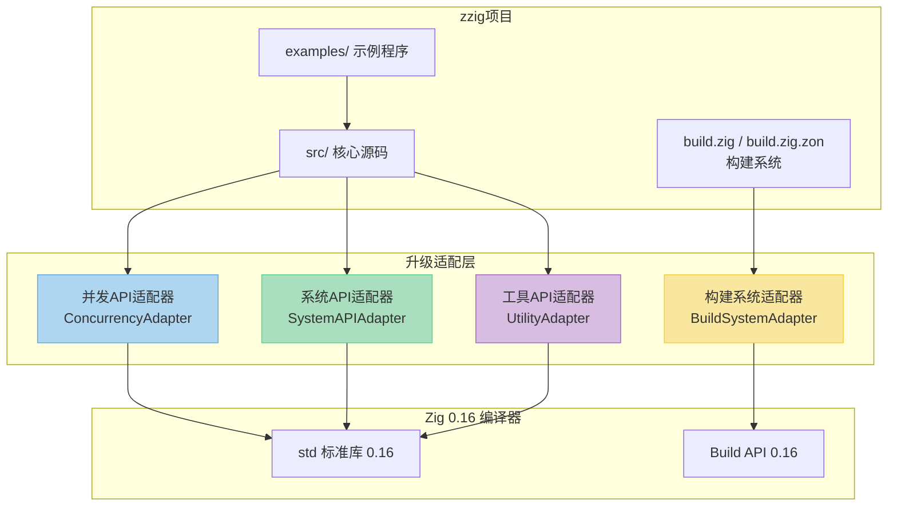
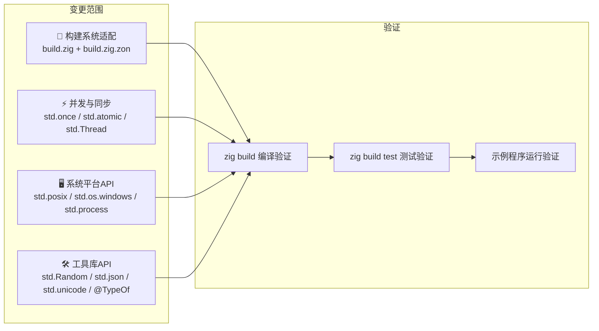
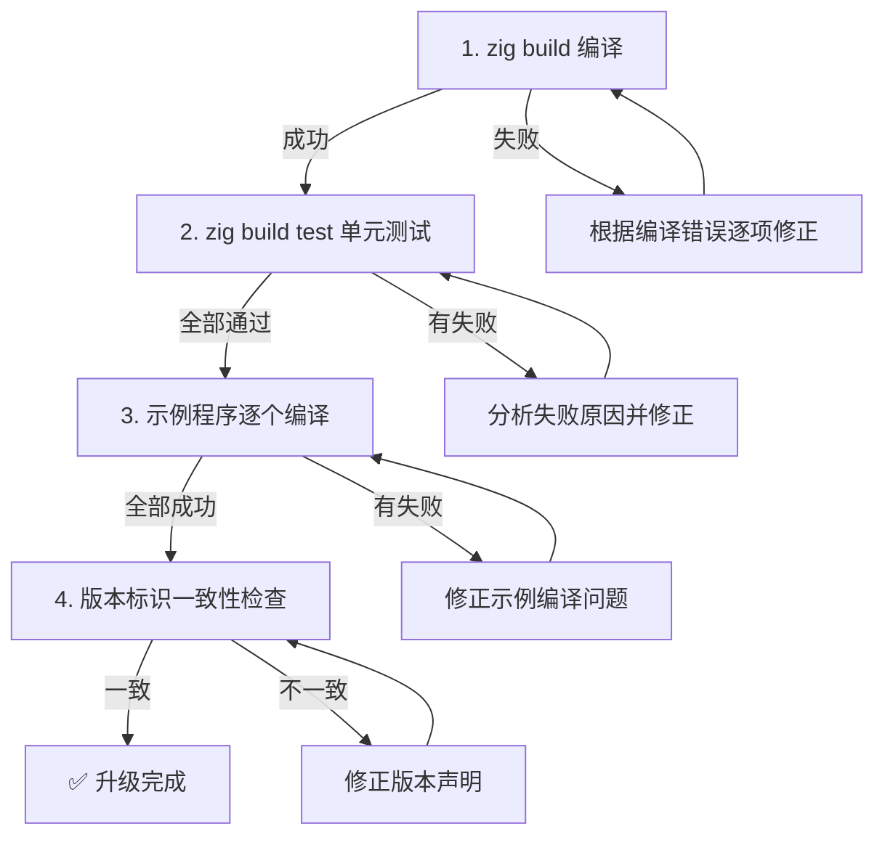

# **1. 实现模型**

## **1.1 上下文视图**



**上下文说明**：zzig 项目当前构建系统（`build.zig`）硬编码 `minor=15` 版本分发，与 `build.zig.zon` 中已声明的 `minimum_zig_version=0.16.0` 存在矛盾。升级需在四个维度同步进行：构建系统适配、并发/同步 API 迁移、系统平台 API 迁移、工具库 API 迁移。

## **1.2 服务/组件总体架构**



**总体策略**：按依赖关系自底向上推进，先完成构建系统适配（解锁编译能力），再按模块逐个迁移标准库 API，最后全量编译验证。

## **1.3 实现设计文档**

### **1.3.1 构建系统适配**

#### **变更目标**

| 文件 | 当前状态 | 目标状态 |
|------|---------|---------|
| `build.zig` | `min_zig_string = "0.15.2"`, `switch(current_zig.minor)` 分发至 `version_15` | `min_zig_string = "0.16.0"`, 移除 switch 分发，构建逻辑直接内联 |
| `build.zig.zon` | `minimum_zig_version = "0.16.0"` (已正确) | 无需变更 |

#### **实现方案**

1. **版本声明统一**：将 `build.zig` 中 `min_zig_string` 从 `"0.15.2"` 更新为 `"0.16.0"`

2. **移除版本分发逻辑**：
   - 删除 `pub fn build(b: *std.Build) void` 中的 `switch (current_zig.minor)` 分发
   - 删除 `const version_15 = struct { ... }` 命名空间包裹
   - 将 `version_15.build()` 的函数体直接提升为 `build()` 函数体
   - 将 `version_15` 内部的 `const Build`, `const Module`, `const OptimizeMode` 类型别名提升到文件顶层

3. **Build API 迁移**（需根据 Zig 0.16 实际变更逐项验证）：
   - `b.addModule(name, .{ .root_source_file = ... })` → 检查签名是否变更
   - `b.createModule(.{ .root_source_file, .target, .optimize })` → 检查字段是否变更
   - `module.addImport(name, dep)` → 检查方法是否变更
   - `b.addExecutable(.{ .name, .root_module })` → 检查签名是否变更
   - `b.addTest(.{ .name, .root_module })` → 检查签名是否变更
   - `b.addObject(.{ .name, .root_module })` → 检查签名是否变更
   - `b.addRunArtifact(artifact)` → 检查签名是否变更
   - `b.addInstallDirectory(.{ .source_dir, .install_dir, .install_subdir })` → 检查字段是否变更
   - `lib.getEmittedDocs()` → 检查方法是否变更

4. **编译期版本检查保留**：`comptime` 块中 `current_zig.order(min_zig) == .lt` 逻辑不变，仅更新版本号

#### **变更后的 build.zig 骨架**

```zig
const std = @import("std");
const builtin = @import("builtin");

const Build = std.Build;
const Module = Build.Module;
const OptimizeMode = std.builtin.OptimizeMode;

const min_zig_string = "0.16.0";  // 更新版本号
const current_zig = builtin.zig_version;

comptime {
    const min_zig = std.SemanticVersion.parse(min_zig_string) catch unreachable;
    if (current_zig.order(min_zig) == .lt) {
        const err_msg = std.fmt.comptimePrint(
            "Your Zig version v{} does not meet the minimum build requirement of v{}",
            .{ current_zig, min_zig },
        );
        @compileError(err_msg);
    }
}

pub fn build(b: *std.Build) void {
    // 原 version_15.build() 的逻辑直接内联于此
    const target = b.standardTargetOptions(.{});
    const optimize = b.standardOptimizeOption(.{});
    // ... 其余构建步骤 ...
}
```

---

### **1.3.2 并发与同步 API 迁移**

#### **1.3.2.1 std.once 迁移**

| 项目 | 说明 |
|------|------|
| **影响文件** | `src/console/console.zig` |
| **当前用法** | `var init_once = std.once(initImpl);` + `init_once.call()` |
| **Zig 0.16 变更** | `std.once` 签名变更：从 `std.once(fn)` 返回可调用对象，变更为 `std.Once` 结构体 + `call` 方法 |

**适配方案**：

```zig
// 0.15 写法
var init_once = std.once(initImpl);
init_once.call();

// 0.16 适配（若 std.once 被重命名为 std.Once）
var init_once: std.Once = std.Once.init();
init_once.call(&init_once, initImpl);

// 或若签名仅微调（需根据 0.16 编译器实际行为确认）
var init_once = std.Once.init();
init_once.call(initImpl);
```

> **注意**：具体适配方式需在 Zig 0.16 环境下编译确认。若 `std.once`/`std.Once` 完全移除，则回退方案为使用 `std.atomic.Value(bool)` + `cmpxchgStrong` 实现等效的单次初始化。

#### **1.3.2.2 std.atomic.Value(T) 迁移**

| 项目 | 说明 |
|------|------|
| **影响文件** | `src/logs/async_logger.zig`, `src/logs/dynamic_queue.zig`, `src/logs/mpmc_queue.zig`, `src/logs/rotation_manager.zig` |
| **当前用法** | `std.atomic.Value(T).init(val)`, `.load()`, `.store()`, `.cmpxchgStrong()`, `.cmpxchgWeak()`, `.fetchAdd()`, `.fetchSub()`, `.fetchMax()`, `.fetchMin()` |

**适配方案**：

Zig 0.16 中 `std.atomic.Value` 的主要变更预计为：
- `.init(val)` 构造方式可能变更为直接字面量 `.{ .raw = val }` 或保持不变
- 方法签名中 `ordering` 参数的枚举类型可能调整

**逐文件适配清单**：

| 文件 | 使用方式 | 适配策略 |
|------|---------|---------|
| `async_logger.zig` | 字段声明 `std.atomic.Value(usize)`, `std.atomic.Value(bool)`, `std.atomic.Value(u64)`, `std.atomic.Value(i64)` | 更新 `.init()` 调用；条件类型 `if (supportsAtomicU64()) std.atomic.Value(u64) else u64` 保持逻辑不变 |
| `dynamic_queue.zig` | `is_resizing: std.atomic.Value(bool)` | 更新 `.init()` 调用 |
| `mpmc_queue.zig` | `head/tail: std.atomic.Value(usize)`, `Slot.sequence: std.atomic.Value(usize)` | 更新 `.init()` 和 `.load()/.cmpxchgWeak()` 调用 |
| `rotation_manager.zig` | `current_file_size/rotation_count: std.atomic.Value(usize)`, `is_rotating: std.atomic.Value(bool)` | 更新 `.init()` 调用 |

#### **1.3.2.3 std.Thread 迁移**

| 项目 | 说明 |
|------|------|
| **影响文件** | `src/logs/async_logger.zig`, `src/logs/mpmc_queue.zig`, `src/profiler/profiler.zig` |
| **当前用法** | `std.Thread.spawn(.{}, fn, args)`, `std.Thread.sleep(ns)`, `std.Thread.getCurrentId()`, `std.Thread.yield()`, `std.Thread.Mutex` |

**适配方案**：

- `std.Thread.spawn` → Zig 0.16 可能变更为 `std.Thread.spawn(.config, fn, args)` 或签名微调，需根据编译错误修正
- `std.Thread.Mutex` → 预计保持兼容，`.{}` 初始化方式不变
- `std.Thread.sleep` / `getCurrentId` / `yield` → 检查是否移至其他模块或签名变更

---

### **1.3.3 系统 API 迁移**

#### **1.3.3.1 std.posix 迁移**

| 项目 | 说明 |
|------|------|
| **影响文件** | `src/console/console.zig`, `src/input/input.zig`, `src/menu/menu.zig` |
| **当前用法** | `std.posix.read()`, `std.posix.STDIN_FILENO`, `std.posix.getenv()`, `std.posix.termios`, `std.posix.tcgetattr()`, `std.posix.tcsetattr()`, `std.posix.V.MIN`, `std.posix.V.TIME` |

**适配方案**：

Zig 0.16 中 `std.posix` 可能的变更方向：
- 部分函数移至 `std.system` 或 `std.c`
- `termios` 类型重命名或字段重组
- `tcgetattr/tcsetattr` 签名变更

```zig
// 0.15 写法
var orig: std.posix.termios = undefined;
try std.posix.tcgetattr(fd, &orig);

// 0.16 可能的适配（示例，需根据实际变更确认）
var orig: std.posix.termios = undefined;
try std.posix.tcgetattr(fd, &orig);  // 若路径不变则无需修改
// 若移至 std.system：
var orig: std.system.termios = undefined;
try std.system.tcgetattr(fd, &orig);
```

#### **1.3.3.2 std.os.windows 迁移**

| 项目 | 说明 |
|------|------|
| **影响文件** | `src/console/console.zig`, `src/input/input.zig`, `src/menu/menu.zig`, `src/logs/logger.zig`, `src/logs/async_logger.zig` |
| **当前用法** | `std.os.windows.HANDLE`, `std.os.windows.DWORD`, `std.os.windows.BOOL`, `std.os.windows.kernel32.*`, `std.os.windows.STD_OUTPUT_HANDLE`, `std.os.windows.STD_INPUT_HANDLE`, `std.os.windows.INVALID_HANDLE_VALUE` |

**适配方案**：

Zig 0.16 中 `std.os.windows` 可能重组为 `std.windows`：
- `const windows = std.os.windows` → `const windows = std.windows`（或确认新路径）
- `std.builtin.CallingConvention.winapi` → 确认是否保留或变更为 `std.windows.winapi`
- `extern "kernel32"` 声明的 `callconv` 参数适配

**逐文件适配清单**：

| 文件 | Windows API 使用 | 适配操作 |
|------|-----------------|---------|
| `console.zig` | `w.kernel32.GetStdHandle`, `w.kernel32.GetConsoleMode`, `w.kernel32.SetConsoleMode`, `w.kernel32.WriteConsoleW`, `w.HANDLE`, `w.DWORD`, `w.BOOL`, `w.STD_OUTPUT_HANDLE`, `w.INVALID_HANDLE_VALUE`, `callconv(winapi)` | 更新 `const windows` 路径 + `callconv` 语法 |
| `input.zig` | `w.kernel32.GetStdHandle`, `w.kernel32.ReadFile`, `w.HANDLE`, `w.DWORD`, `w.BOOL`, `w.STD_INPUT_HANDLE`, `callconv(winapi)` | 同上 |
| `menu.zig` | `w.kernel32.GetStdHandle`, `w.kernel32.GetConsoleMode`, `w.DWORD`, `w.STD_OUTPUT_HANDLE`, `w.INVALID_HANDLE_VALUE` | 更新路径 |
| `logger.zig` | `w.kernel32.GetStdHandle`, `w.kernel32.WriteConsoleW`, `w.DWORD`, `w.STD_OUTPUT_HANDLE`, `w.INVALID_HANDLE_VALUE` | 更新路径 |
| `async_logger.zig` | `w.kernel32.GetStdHandle`, `w.kernel32.WriteConsoleW`, `w.DWORD`, `w.STD_OUTPUT_HANDLE`, `w.INVALID_HANDLE_VALUE` | 更新路径 |

#### **1.3.3.3 std.process.Child 迁移**

| 项目 | 说明 |
|------|------|
| **影响文件** | `src/menu/menu.zig` |
| **当前用法** | `std.process.Child.run(.{ .allocator = ..., .argv = &... })` |

**适配方案**：检查 `std.process.Child.run` 的参数结构体字段是否变更（如 `.allocator` → `.arena` 或方法签名重组）。

#### **1.3.3.4 std.unicode 迁移**

| 项目 | 说明 |
|------|------|
| **影响文件** | `src/logs/async_logger.zig`, `src/logs/logger.zig`, `src/xml/scanner.zig` |
| **当前用法** | `std.unicode.utf8ToUtf16LeAlloc()`, `std.unicode.utf8ByteSequenceLength()`, `std.unicode.utf8Decode()`, `std.unicode.utf8Encode()` |

**适配方案**：检查各函数签名变更（如返回类型从 `!?[]u16` 变更为其他）或函数重命名。

---

### **1.3.4 工具库 API 迁移**

#### **1.3.4.1 std.Random 迁移**

| 项目 | 说明 |
|------|------|
| **影响文件** | `src/profiler/profiler.zig` |
| **当前用法** | `std.Random.DefaultPrng`, `std.Random.DefaultPrng.init(seed)`, `prng.random().float(f32)` |

**适配方案**：

Zig 0.16 中 `std.Random` 可能重组为 `std.Random` 保持不变，或 `DefaultPrng` 重命名。需确认：
- `std.Random.DefaultPrng.init(seed)` → 签名是否变更
- `prng.random().float(f32)` → `random()` 方法是否变更

#### **1.3.4.2 std.json 迁移**

| 项目 | 说明 |
|------|------|
| **影响文件** | `src/logs/async_logger_config.zig` |
| **当前用法** | `json.parseFromSlice(json.Value, allocator, buffer, .{})`, `parsed.value.object`, `root.get("key")`, `v.integer`, `v.string`, `v.bool`, `v.float` |

**适配方案**：

Zig 0.16 中 `std.json` 可能的重大变更：
- `json.Value` 联合体字段名变更（如 `.integer` → `.number_integer`，`.float` → `.number_float`）
- `parseFromSlice` 签名或返回值变更
- `parsed.value.object` 访问路径变更

```zig
// 0.15 写法
const parsed = try json.parseFromSlice(json.Value, allocator, buffer, .{});
const root = parsed.value.object;
if (root.get("queue_capacity")) |v| {
    config.queue_capacity = @intCast(v.integer);
}

// 0.16 适配（示例，需根据实际变更确认）
const parsed = try json.parseFromSlice(json.Value, allocator, buffer, .{});
const root = parsed.value.object;
if (root.get("queue_capacity")) |v| {
    config.queue_capacity = @intCast(v.integer);  // 若字段名变更则更新
}
```

#### **1.3.4.3 @TypeOf(func).ReturnType 迁移**

| 项目 | 说明 |
|------|------|
| **影响文件** | `src/profiler/profiler.zig` |
| **当前用法** | `@TypeOf(func).ReturnType` |

**适配方案**：

Zig 0.16 中类型内省 API 的命名约定从 PascalCase 变更为 snake_case：
- `@TypeOf(func).ReturnType` → `@TypeOf(func).return_type`

```zig
// 0.15 写法
pub inline fn profile(...) @TypeOf(func).ReturnType { ... }

// 0.16 适配
pub inline fn profile(...) @TypeOf(func).return_type { ... }
```

#### **1.3.4.4 std.crypto.random 迁移**

| 项目 | 说明 |
|------|------|
| **影响文件** | `src/random/randoms.zig` |
| **当前用法** | `std.crypto.random.uintLessThan(usize, chars.len)` |

**适配方案**：确认 `std.crypto.random` 全局实例和方法签名是否变更。该 API 较稳定，大概率无需修改。

---

### **1.3.5 编译验证与版本标识更新**

#### **验证流程**



#### **验证清单**

| 序号 | 验证项 | 命令/方法 | 通过条件 |
|------|--------|----------|---------|
| 1 | 全量编译 | `zig build` | 退出码 0，无编译错误 |
| 2 | 单元测试 | `zig build test` | 所有测试用例 PASS |
| 3 | 版本一致性 | 检查 `build.zig` 中 `min_zig_string` 与 `build.zig.zon` 中 `minimum_zig_version` | 均为 `"0.16.0"` |
| 4 | 无残留 0.15 引用 | 搜索源码中 `version_15`、`minor == 15`、`"0.15"` | 无匹配 |
| 5 | 示例程序编译 | `zig build` 各 step | 全部编译成功 |
| 6 | 无新增编译警告 | 检查编译输出 | 无 warning |

---

# **2. 接口设计**

## **2.1 总体设计**

本次升级**不改变 zzig 库的公共 API**（`pub` 导出的类型和函数签名）。所有变更均为内部实现适配，对外接口保持向后兼容。

**接口兼容性原则**：
- 所有 `pub fn`、`pub const`、`pub type` 的签名不得破坏性变更
- 下游项目仅需将 Zig 编译器从 0.15 升级到 0.16，无需修改自身代码
- 内部 `std` 库调用替换为 0.16 等效 API，保持相同语义

## **2.2 接口清单**

### **2.2.1 变更影响矩阵**

| 模块 | 公共接口 | 内部实现变更 | 接口签名变更 |
|------|---------|------------|------------|
| logger | `debug/info/warn/err/print/always` | `std.os.windows` 路径、`std.unicode` API | ❌ 无 |
| async_logger | `AsyncLogger` 所有 `pub` 方法 | `std.atomic.Value`、`std.Thread`、`std.os.windows`、`std.unicode` | ❌ 无 |
| console | `init/deinit/setup/supportsAnsiColors`、`Color` | `std.once` → `std.Once`、`std.posix.getenv`、`std.os.windows` | ❌ 无 |
| json | `JsonParser` 所有 `pub` 方法 | 无直接 `std.json` 依赖 | ❌ 无 |
| xml | `XmlReader/XmlDom/XmlWriter` 所有 `pub` 方法 | `scanner.zig` 中 `std.unicode.utf8Encode` | ❌ 无 |
| menu | `showMenu/readLine/clearScreen` 等 | `std.posix.read`、`std.os.windows`、`std.process.Child.run` | ❌ 无 |
| profiler | `Profiler` 所有 `pub` 方法、`profile()` | `std.Random.DefaultPrng`、`@TypeOf().ReturnType` | ❌ 无 |
| input | `readKey()` | `std.posix.read/termios/tcgetattr/tcsetattr`、`std.os.windows` | ❌ 无 |
| random | `RandomString/RandomChar` | `std.crypto.random.uintLessThan` | ❌ 无 |
| string | `Strings` 所有 `pub` 方法 | 无直接 `std` 破坏性 API | ❌ 无 |

### **2.2.2 Build 系统接口**

| 接口 | 变更说明 |
|------|---------|
| `pub fn build(b: *std.Build) void` | 移除 `switch` 版本分发，逻辑直接内联；签名不变 |
| Build steps | 所有 step 名称（`async-demo`、`config-demo`、`test` 等）保持不变 |
| Module 导出 | `b.addModule("zzig", ...)` 导出名称不变 |

---

# **4. 数据模型**

## **4.1 设计目标**

本次升级不涉及数据模型的新增或重构。数据模型相关变更仅限于因标准库类型变更导致的内部字段类型适配，确保：

1. **零破坏性变更**：所有 `pub` 数据结构对外接口不变
2. **语义等价**：适配后的内部类型与原类型在并发语义、内存布局上等价
3. **平台兼容**：ARMv6 原子操作降级策略保持不变

## **4.2 模型实现**

### **4.2.1 条件原子类型模型（保持不变）**

async_logger 和 rotation_manager 中的条件原子类型模型是 zzig 的核心设计模式，升级后**保持不变**：

```zig
// 条件原子类型：支持 64 位原子的平台使用 std.atomic.Value，否则使用普通类型 + Mutex
current_file_size: if (supportsAtomicU64()) std.atomic.Value(u64) else u64,
current_file_size_mutex: if (!supportsAtomicU64()) std.Thread.Mutex else void,

// 初始化分支
if (comptime supportsAtomicU64()) {
    self.current_file_size = std.atomic.Value(u64).init(0);  // API 调用可能需适配
} else {
    self.current_file_size = 0;
    self.current_file_size_mutex = std.Thread.Mutex{};
}
```

> **适配要点**：`supportsAtomicU64()`/`supportsAtomicI64()` 函数基于 `builtin.cpu.arch` 的 switch 逻辑不受 Zig 版本影响，无需修改。仅需适配 `std.atomic.Value(T).init()` 的调用方式。

### **4.2.2 版本声明数据**

| 数据项 | 当前值 | 目标值 | 位置 |
|--------|--------|--------|------|
| `min_zig_string` | `"0.15.2"` | `"0.16.0"` | `build.zig` L5 |
| `minimum_zig_version` | `"0.16.0"` | `"0.16.0"` | `build.zig.zon` L21 |
| 版本分发分支 | `minor == 15` | 移除分发 | `build.zig` L21-24 |

### **4.2.3 受影响文件汇总**

| 类别 | 文件 | 主要变更点 |
|------|------|-----------|
| **构建系统** | `build.zig` | 版本号 + 分发逻辑移除 + Build API 适配 |
| **构建系统** | `build.zig.zon` | 无需变更（已为 0.16.0） |
| **并发/同步** | `src/console/console.zig` | `std.once` → `std.Once` |
| **并发/同步** | `src/logs/async_logger.zig` | `std.atomic.Value`、`std.Thread.spawn`、`std.os.windows`、`std.unicode` |
| **并发/同步** | `src/logs/dynamic_queue.zig` | `std.atomic.Value(bool)` |
| **并发/同步** | `src/logs/mpmc_queue.zig` | `std.atomic.Value(usize)`、`std.Thread.spawn/yield` |
| **并发/同步** | `src/logs/rotation_manager.zig` | `std.atomic.Value`、`std.Thread.Mutex` |
| **并发/同步** | `src/logs/logger.zig` | `std.Thread.Mutex`、`std.os.windows`、`std.unicode` |
| **系统API** | `src/input/input.zig` | `std.posix.*`、`std.os.windows`、`callconv(winapi)` |
| **系统API** | `src/menu/menu.zig` | `std.posix.read`、`std.os.windows`、`std.process.Child.run` |
| **工具库** | `src/profiler/profiler.zig` | `std.Random.DefaultPrng`、`@TypeOf().ReturnType` → `.return_type` |
| **工具库** | `src/logs/async_logger_config.zig` | `std.json.parseFromSlice`、`json.Value` 联合体字段 |
| **工具库** | `src/random/randoms.zig` | `std.crypto.random.uintLessThan` |
| **工具库** | `src/xml/scanner.zig` | `std.unicode.utf8Encode` |
| **示例** | `examples/` 下 25 个文件 | 随主模块 API 变更重新编译验证 |
