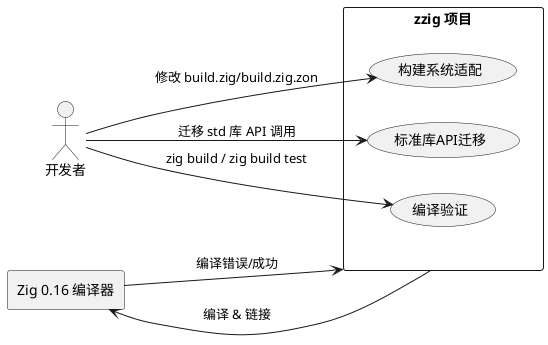
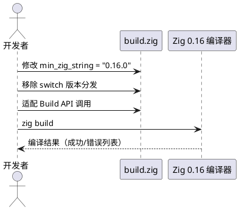
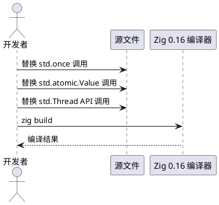
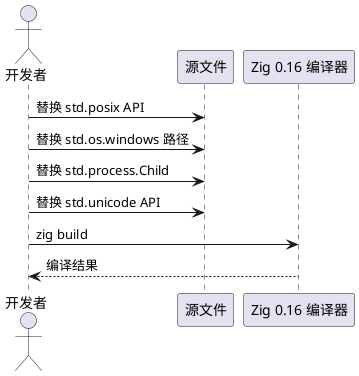
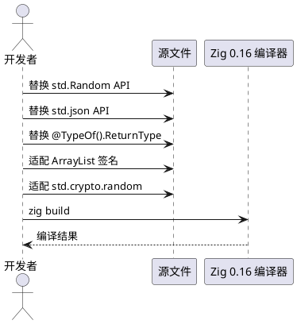
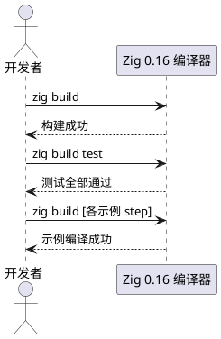

# **1. 组件定位**

## **1.1 核心职责**

本组件负责将 zzig 工具库从 Zig 0.15.x 编译环境升级适配到 Zig 0.16 版本，实现构建系统和标准库API的全面兼容。

## **1.2 核心输入**

1. **当前项目源码**：build.zig、build.zig.zon、src/ 下 25 个 .zig 文件、examples/ 下 25 个 .zig 文件
2. **Zig 0.16 标准库变更清单**：API 重命名、签名变更、模块重组等破坏性变更
3. **Zig 0.16 构建系统变更**：Build API 调整（addModule/createModule/addExecutable 等方法签名变更）

## **1.3 核心输出**

1. **适配后的源码**：所有 .zig 文件可在 Zig 0.16 编译器下无错误编译
2. **更新的版本声明**：build.zig 和 build.zig.zon 中的最低版本号统一为 0.16.0
3. **通过编译的构建产物**：zig build 和 zig build test 均可成功执行

## **1.4 职责边界**

1. **不负责**添加新的业务功能或模块
2. **不负责**重构代码架构或优化性能（除非因 API 变更必须调整）
3. **不负责**适配 Zig 0.17 及以上版本
4. **不负责**修改公共 API 的对外接口签名（保持下游兼容）

# **2. 领域术语**

**构建系统适配**
: 将 build.zig 和 build.zig.zon 中的版本分发逻辑、Build API 调用方式从 Zig 0.15 语法迁移到 Zig 0.16 语法的过程。

**标准库 API 迁移**
: 将源码中对 Zig 0.15 标准库 API 的调用替换为 Zig 0.16 中等效 API 调用的过程，包括重命名、签名变更、模块路径变更等。

**版本分发逻辑**
: build.zig 中根据 `builtin.zig_version.minor` 选择不同版本构建路径的 switch 机制。

**破坏性变更**
: Zig 0.16 版本中不向后兼容的标准库 API 或构建系统 API 变更，会导致现有代码编译失败。

**原子操作降级**
: 在不支持 64 位原子操作的平台上（如 ARMv6），使用 Mutex 代替 atomic 操作的兼容策略。

# **3. 角色与边界**

## **3.1 核心角色**

- **开发者**：执行升级适配工作，修改源码并验证编译结果
- **用户**：使用 zzig 库的下游项目，期望在 Zig 0.16 环境中无缝使用

## **3.2 外部系统**

- **Zig 0.16 编译器**：提供新的标准库 API 和构建系统，验证代码编译通过
- **Zig 0.15 编译器**：当前项目可正常编译的环境，升级后不再需要支持

## **3.3 交互上下文**

# **4. DFX约束**

## **4.1 性能**

1. 升级适配后的运行时性能不得低于升级前水平
2. 编译时间增幅不得超过 20%（由 Zig 编译器自身决定，适配代码不应引入额外编译开销）

## **4.2 可靠性**

1. 升级后的所有现有单元测试必须全部通过
2. 升级后的所有现有示例程序必须能正常编译和运行
3. 不得引入新的编译警告

## **4.3 安全性**

1. 升级过程中不得降低现有安全性保证（如 std.crypto.random 的密码学安全随机数使用）
2. Windows API 调用（kernel32 等）的 callconv 和类型声明必须与 Zig 0.16 规范一致

## **4.4 可维护性**

1. 升级后移除 version_15 构建路径（不再需要多版本分发逻辑）
2. 版本声明必须与实际最低支持版本一致，消除 build.zig 与 build.zig.zon 的矛盾

## **4.5 兼容性**

1. zzig 库的公共 API（pub 导出的类型和函数）对外接口签名不得因升级而破坏性变更
2. 下游项目仅需将 Zig 编译器从 0.15 升级到 0.16 即可使用适配后的 zzig，无需修改自身代码

# **5. 核心能力**

## **5.1 构建系统适配**

### **5.1.1 业务规则**

1. **最低版本声明统一**：build.zig 中的 `min_zig_string` 和 build.zig.zon 中的 `.minimum_zig_version` 必须统一为 "0.16.0"
   - 验收条件：[读取 build.zig 中 min_zig_string 和 build.zig.zon 中 minimum_zig_version] → [两者均为 "0.16.0"]

2. **版本分发逻辑简化**：必须移除基于 `current_zig.minor` 的 switch 分发机制，将 version_15 的构建逻辑直接作为唯一的 build 函数实现
   - 验收条件：[使用 Zig 0.16 编译 build.zig] → [不触发 @compileError("unknown version!")，构建正常执行]

3. **Build API 迁移**：必须将 `b.addModule`、`b.createModule`、`b.addExecutable` 等 Build 系统 API 调用适配到 Zig 0.16 的新签名
   - 验收条件：[执行 zig build] → [所有 Build 步骤正确注册，无编译错误]

4. **编译期版本检查保留**：必须保留 `comptime` 块中对最低 Zig 版本的检查逻辑，确保版本号更新为 0.16.0
   - 验收条件：[使用 Zig 0.15.x 编译] → [触发 @compileError，提示版本不满足最低要求]

5. **禁止项**：禁止保留 version_15 命名空间或任何 Zig 0.15 专用构建路径
   - 验收条件：[搜索 build.zig 中 "version_15" 或 "minor == 15"] → [无匹配结果]

### **5.1.2 交互流程**

### **5.1.3 异常场景**

1. **Build API 签名不兼容**
   - 触发条件：Zig 0.16 中 addModule/createModule/addExecutable 的参数结构发生变更
   - 系统行为：根据 Zig 0.16 编译器报错信息，逐个修正参数字段名和类型
   - 用户感知：zig build 输出的编译错误信息

2. **版本检查过于严格**
   - 触发条件：Zig 0.16.1 或更高 patch 版本被错误拒绝
   - 系统行为：确保版本比较使用 `.lt`（小于）语义，允许 patch 版本向上兼容
   - 用户感知：使用 Zig 0.16.x（x>0）编译时应正常通过

## **5.2 标准库 API 迁移 - 并发与同步**

### **5.2.1 业务规则**

1. **std.once 迁移**：必须将 `std.once` 调用适配到 Zig 0.16 的新 API（若 std.once 签名变更或移除，需使用等效的线程安全单次初始化机制）
   - 验收条件：[console.zig 中 init_once 的声明和调用] → [在 Zig 0.16 下编译通过，且功能不变]

2. **std.atomic.Value 迁移**：必须将 `std.atomic.Value(T)` 及其 `.init()`、`.load()`、`.store()`、`.cmpxchgStrong()`、`.cmpxchgWeak()`、`.fetchAdd()`、`.fetchSub()`、`.fetchMax()`、`.fetchMin()` 方法适配到 Zig 0.16 的新签名
   - 验收条件：[async_logger.zig、dynamic_queue.zig、mpmc_queue.zig、rotation_manager.zig 中所有 std.atomic.Value 使用] → [在 Zig 0.16 下编译通过，且并发语义不变]

3. **std.Thread 迁移**：必须将 `std.Thread.spawn`、`std.Thread.sleep`、`std.Thread.getCurrentId`、`std.Thread.yield`、`std.Thread.Mutex` 适配到 Zig 0.16 的新 API
   - 验收条件：[所有使用 std.Thread 的源文件] → [在 Zig 0.16 下编译通过，且线程行为不变]

### **5.2.2 交互流程**

### **5.2.3 异常场景**

1. **原子操作 API 签名变更**
   - 触发条件：Zig 0.16 中 std.atomic.Value 的方法名或参数顺序发生变化
   - 系统行为：根据编译错误逐个修正方法调用，保持原语义
   - 用户感知：编译错误信息，指出具体的方法签名不匹配

2. **std.once 被移除或重命名**
   - 触发条件：Zig 0.16 标准库中不存在 std.once
   - 系统行为：实现等效的单次初始化机制（如使用 std.atomic.Value(bool) + cmpxchg）
   - 用户感知：编译错误信息中 std.once 未定义

## **5.3 标准库 API 迁移 - 系统 API**

### **5.3.1 业务规则**

1. **std.posix 迁移**：必须将 `std.posix.read`、`std.posix.STDIN_FILENO`、`std.posix.getenv`、`std.posix.termios`、`std.posix.tcgetattr`、`std.posix.tcsetattr`、`std.posix.V` 适配到 Zig 0.16 的新位置或签名
   - 验收条件：[input.zig、menu.zig、console.zig 中所有 std.posix 调用] → [在 Zig 0.16 下编译通过]

2. **std.os.windows 迁移**：必须将 `std.os.windows` 下的类型和 kernel32 API 调用适配到 Zig 0.16 的新模块路径
   - 验收条件：[console.zig、input.zig、menu.zig、logger.zig、async_logger.zig 中所有 std.os.windows 调用] → [在 Zig 0.16 下编译通过]

3. **std.process.Child 迁移**：必须将 `std.process.Child.run` 适配到 Zig 0.16 的新 API
   - 验收条件：[menu.zig 中 std.process.Child.run 调用] → [在 Zig 0.16 下编译通过]

4. **std.unicode 迁移**：必须将 `std.unicode.utf8ToUtf16LeAlloc`、`std.unicode.utf8ByteSequenceLength`、`std.unicode.utf8Decode`、`std.unicode.utf8Encode` 适配到 Zig 0.16 的新 API
   - 验收条件：[logger.zig、async_logger.zig、scanner.zig 中所有 std.unicode 调用] → [在 Zig 0.16 下编译通过]

### **5.3.2 交互流程**

### **5.3.3 异常场景**

1. **std.posix 模块重组**
   - 触发条件：Zig 0.16 将部分 std.posix API 移动到其他模块（如 std.system 或 std.c）
   - 系统行为：根据 Zig 0.16 标准库文档定位新路径，更新 import 和调用
   - 用户感知：编译错误信息中 std.posix.xxx 未定义

2. **Windows API 类型变更**
   - 触发条件：std.os.windows 中的类型（HANDLE、DWORD、BOOL 等）被移动或重命名
   - 系统行为：根据 Zig 0.16 标准库更新类型引用路径
   - 用户感知：编译错误信息中类型未定义

## **5.4 标准库 API 迁移 - 数据结构与工具**

### **5.4.1 业务规则**

1. **std.Random 迁移**：必须将 `std.Random.DefaultPrng` 及其方法适配到 Zig 0.16 的新 API
   - 验收条件：[profiler.zig 中 std.Random.DefaultPrng 使用] → [在 Zig 0.16 下编译通过]

2. **std.json 迁移**：必须将 `std.json` 模块的 API 适配到 Zig 0.16 的新版本
   - 验收条件：[async_logger_config.zig 中 std.json 使用] → [在 Zig 0.16 下编译通过]

3. **@TypeOf(func).ReturnType 迁移**：必须将 `@TypeOf(func).ReturnType` 适配到 Zig 0.16 的新内省 API（可能变更为 @TypeOf(func).return_type 或其他）
   - 验收条件：[profiler.zig 中 profile 函数的返回类型推导] → [在 Zig 0.16 下编译通过]

4. **ArrayList 方法签名适配**：必须将 ArrayList 的方法调用适配到 Zig 0.16 的新签名（如有变更）
   - 验收条件：[所有使用 ArrayList 的源文件] → [在 Zig 0.16 下编译通过]

5. **std.crypto.random 迁移**：必须确保 `std.crypto.random` 的使用方式与 Zig 0.16 兼容
   - 验收条件：[randoms.zig 中 std.crypto.random.uintLessThan 调用] → [在 Zig 0.16 下编译通过，且密码学安全保证不变]

### **5.4.2 交互流程**

### **5.4.3 异常场景**

1. **@TypeOf 内省 API 变更**
   - 触发条件：Zig 0.16 中 @TypeOf 结果类型的字段名从 ReturnType 变更为 return_type 或其他
   - 系统行为：根据编译错误更新为 Zig 0.16 的正确字段名
   - 用户感知：编译错误信息中字段不存在

2. **std.json 解析 API 重大变更**
   - 触发条件：Zig 0.16 中 std.json 的解析接口完全重构
   - 系统行为：按照 Zig 0.16 文档重写 JSON 配置文件的解析逻辑
   - 用户感知：编译错误信息中 std.json 旧 API 未定义

## **5.5 编译验证与版本标识更新**

### **5.5.1 业务规则**

1. **完整编译验证**：所有源文件和示例文件在 Zig 0.16 下必须编译无错误
   - 验收条件：[执行 zig build] → [返回退出码 0，无编译错误]

2. **单元测试验证**：所有现有单元测试在 Zig 0.16 下必须全部通过
   - 验收条件：[执行 zig build test] → [所有测试用例通过，无 FAIL]

3. **示例程序验证**：所有示例程序在 Zig 0.16 下必须能正常编译
   - 验收条件：[执行 zig build 针对每个示例的 step] → [编译成功]

4. **版本标识一致性**：项目中所有涉及 Zig 版本声明的位置必须统一指向 0.16.0
   - 验收条件：[检查 build.zig 的 min_zig_string 和 build.zig.zon 的 minimum_zig_version] → [均为 "0.16.0"]

5. **禁止项**：禁止在源码中残留任何 Zig 0.15 专用的 API 调用或条件分支
   - 验收条件：[搜索源码中 "0.15" 或 "minor == 15"] → [无匹配结果]

### **5.5.2 交互流程**

### **5.5.3 异常场景**

1. **部分测试用例失败**
   - 触发条件：升级后某些测试因标准库行为微调而失败
   - 系统行为：分析失败原因，若为标准库行为变更导致，则调整测试预期值；若为真正的回归缺陷，则修复代码逻辑
   - 用户感知：zig build test 输出的失败测试列表

2. **示例程序运行时错误**
   - 触发条件：示例程序编译通过但运行时崩溃或输出异常
   - 系统行为：调试运行时行为，定位因 API 迁移引入的语义差异并修正
   - 用户感知：程序崩溃信息或异常输出

3. **交叉平台兼容性回归**
   - 触发条件：Windows/Unix 平台特有代码在 Zig 0.16 下表现不一致
   - 系统行为：在各目标平台上分别验证，修正平台条件分支中的 API 调用
   - 用户感知：特定平台上的编译错误或运行时错误

# **6. 数据约束**

## **6.1 版本声明**

1. **min_zig_string**：字符串类型，格式为 "X.Y.Z"（语义化版本），当前需更新为 "0.16.0"
2. **minimum_zig_version**：字符串类型，格式为 "X.Y.Z"，当前为 "0.16.0"（已正确），需与 build.zig 保持一致
3. **version分发分支**：枚举值，当前仅支持 minor=15，需移除分发逻辑，直接执行构建

## **6.2 受影响的源文件**

1. **构建系统文件**：build.zig（版本声明 + 分发逻辑 + Build API）、build.zig.zon（版本声明）
2. **并发相关文件**：async_logger.zig、dynamic_queue.zig、mpmc_queue.zig、rotation_manager.zig（std.atomic.Value、std.Thread）
3. **系统API相关文件**：console.zig（std.once、std.posix、std.os.windows）、input.zig（std.posix）、menu.zig（std.posix、std.process.Child、std.os.windows）、logger.zig（std.os.windows、std.unicode）
4. **工具库相关文件**：profiler.zig（std.Random、@TypeOf.ReturnType）、async_logger_config.zig（std.json）、randoms.zig（std.crypto.random）、scanner.zig（std.unicode）
5. **示例文件**：examples/ 下所有 25 个 .zig 文件（依赖 zzig 模块导入，需随主模块变更重新编译验证）

## **6.3 Zig 0.16 已知破坏性变更（需适配的 API 清单）**

1. **std.once**：签名或调用方式变更 → 影响文件：console.zig
2. **std.atomic.Value(T)**：类型或方法签名变更 → 影响文件：async_logger.zig、dynamic_queue.zig、mpmc_queue.zig、rotation_manager.zig
3. **std.posix.***：模块路径或函数签名变更 → 影响文件：input.zig、menu.zig、console.zig
4. **std.os.windows**：模块路径变更 → 影响文件：console.zig、input.zig、menu.zig、logger.zig、async_logger.zig
5. **std.process.Child**：API 签名变更 → 影响文件：menu.zig
6. **std.Random**：类型重组或重命名 → 影响文件：profiler.zig
7. **std.json**：解析接口重构 → 影响文件：async_logger_config.zig
8. **std.unicode**：函数签名或路径变更 → 影响文件：logger.zig、async_logger.zig、scanner.zig
9. **@TypeOf(func).ReturnType**：内省 API 字段名变更 → 影响文件：profiler.zig
10. **Build 系统 API**：addModule/createModule/addExecutable 等方法签名变更 → 影响文件：build.zig
